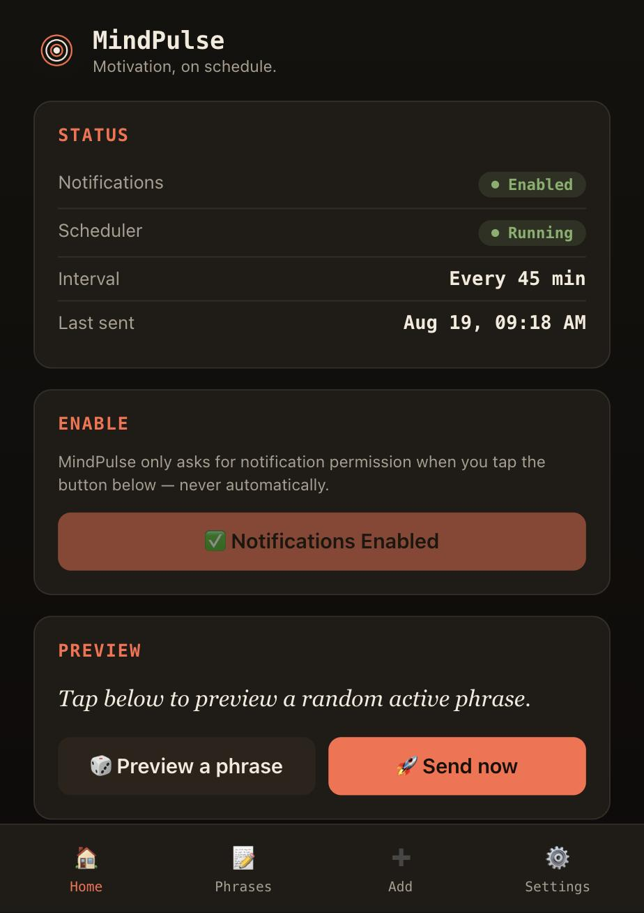
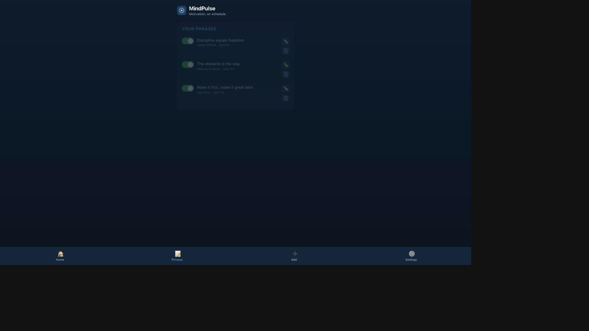
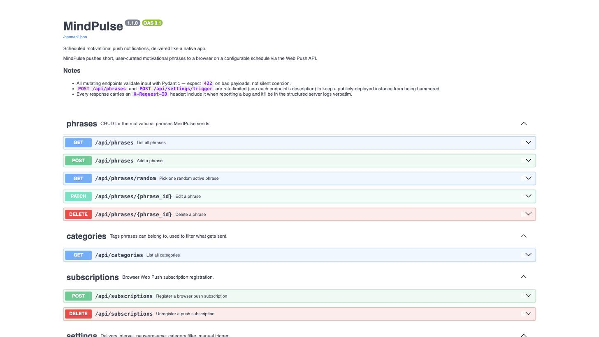

# MindPulse

[](https://github.com/hilexa-hlxa/MindPulse/actions/workflows/ci.yml)
[](LICENSE)

Scheduled motivational push notifications, delivered like a native app.

MindPulse is a Progressive Web App: install it to your phone's home screen and
it pushes a short, user-curated phrase to you on a configurable interval — a
FastAPI + APScheduler backend driving the Web Push API, with a vanilla
HTML/CSS/JS frontend (no framework, by design). Built as a portfolio project
demonstrating fullstack Python, background scheduling, PWA setup, and clean
REST API design.





## Features

- 🔔 One-tap "Enable Notifications" — permission is only ever requested on an
  explicit tap, never on page load
- ⏱️ Configurable delivery interval (15 min – 4 h), reschedules live, no
  server restart needed
- ✍️ Add, edit, toggle, and delete your own motivational phrases
- 🏷️ Tag phrases with categories and filter what gets sent by category
- 🚀 Manual "send now" trigger, independent of the schedule
- ⏸️ Pause/resume the whole scheduler with one switch
- 📊 `/api/stats` + a Dashboard card: active phrases, subscribers, sent
  today, most-sent phrase
- 🔁 Push delivery retries transient failures 3× with exponential backoff
  before giving up, and logs every attempt to a `delivery_log` table
- 🪵 Structured JSON logging with a request ID threaded through every log
  line of a request
- 🚦 Rate-limited write endpoints (`slowapi`) so a public deployment can't
  be trivially hammered
- 📱 Installable PWA: manifest + service worker, works offline for the app
  shell, receives push while the browser is closed
- 📲 Real install prompt on Chrome/Edge/Android (captured `beforeinstallprompt`,
  verified firing against Chrome's actual installability audit) plus a manual
  "Add to Home Screen" hint for iOS Safari, which never fires that event
- 🧪 54 passing pytest tests (CRUD, validation, scheduler, push retry logic,
  rate limits, stats, categories) + one real-browser Playwright E2E test
- 🐳 Dockerfile + docker-compose (with a real Postgres service) for a
  production-like local run
- ✅ CI on every push/PR: ruff lint + full pytest suite + the E2E test
- 📮 Bruno API collection (`bruno/`) — clone and hit every endpoint in
  under a minute, no Swagger UI needed

## Architecture

```
Browser (PWA)  ←→  FastAPI Server  ←→  SQLite / Postgres
                        │
                        ▼
              APScheduler (background, in-process)
                        │
                        ▼
         pywebpush → Push Service → Service Worker → Notification
```

- **Backend** — FastAPI + SQLAlchemy 2.0 (async) + Alembic migrations.
  `AsyncIOScheduler` runs on the same event loop as the API, so its job body
  can `await` DB queries and push sends directly.
- **Frontend** — a single HTML page with four views (Dashboard, Phrases, Add,
  Settings) swapped by a tiny vanilla-JS router; no build step.
- **Push** — the browser's own Push API + a service worker (`sw.js`); the
  backend never talks to the browser directly, only to the browser vendor's
  push service, authenticated with a VAPID key pair.

## Tech Stack

| Layer | Choice |
|---|---|
| API framework | FastAPI |
| Background scheduling | APScheduler (`AsyncIOScheduler`) |
| ORM | SQLAlchemy 2.0 (async) |
| Migrations | Alembic |
| Database | SQLite (dev) / Postgres (production) |
| Push | pywebpush + VAPID |
| Logging | structlog (JSON, request-ID-scoped) |
| Rate limiting | slowapi |
| Frontend | HTML5 / CSS3 / vanilla JS, Service Worker API, Web App Manifest |
| Tests | pytest + pytest-asyncio + httpx `ASGITransport` + Playwright (E2E) |
| API client | Bruno collection (`bruno/`) |
| Deploy | Render.com or Railway (free tier), or the included Dockerfile |

## Project Layout

```
mindpulse/
├── backend/
│   ├── main.py                  # FastAPI app entry point, middleware, OpenAPI metadata
│   ├── config.py                 # Settings, VAPID keys, env vars
│   ├── database.py               # SQLAlchemy async engine + session
│   ├── logging_config.py         # structlog JSON setup
│   ├── rate_limit.py              # shared slowapi Limiter
│   ├── models/                   # Phrase, PushSubscription, AppSettings, Category, DeliveryLog
│   ├── schemas/                  # Pydantic request/response models
│   ├── routers/                  # phrases, subscriptions, settings, categories, stats
│   ├── services/                 # scheduler, push (retry logic), phrase_repo, category_repo, settings_repo
│   ├── scripts/                  # generate_vapid_keys.py, generate_icons.py, seed_demo_phrases.py
│   ├── alembic/                  # DB migrations
│   └── tests/                    # pytest suite (53 tests) + test_e2e.py (Playwright, separate marker)
├── frontend/
│   ├── index.html
│   ├── app.js
│   ├── style.css
│   ├── sw.js                     # Service Worker
│   ├── manifest.json
│   └── icons/
├── bruno/                         # API collection — every endpoint, runnable via `npx @usebruno/cli run`
├── .github/workflows/ci.yml       # lint + test + E2E on every push/PR
├── .env.example
├── requirements.txt
├── requirements-dev.txt           # ruff, playwright — not needed to run the app
├── pyproject.toml                 # ruff config
├── Dockerfile
├── docker-compose.yml             # app + real Postgres, for local/demo use
├── Procfile                       # Railway / generic
├── render.yaml                    # Render.com blueprint
└── CHANGELOG.md
```

## Setup

### 1. Clone and install

```bash
python3 -m venv .venv
source .venv/bin/activate
pip install -r requirements.txt
pip install -r requirements-dev.txt   # optional: ruff + Playwright, for linting/E2E
```

### 2. Generate a VAPID key pair

Web Push requires a VAPID key pair for authenticating notifications:

```bash
python backend/scripts/generate_vapid_keys.py
```

Copy the printed keys into a new `.env` file (start from `.env.example`):

```bash
cp .env.example .env
# then paste VAPID_PRIVATE_KEY / VAPID_PUBLIC_KEY into .env
```

**Never commit `.env`** — it's already in `.gitignore`.

### 3. Run migrations

```bash
alembic upgrade head
```

(For local dev this is optional — the app also calls `create_all` on
startup — but it's how a real Postgres deploy gets its schema.)

### 4. (Optional) Generate app icons or seed demo phrases

Icons are already committed under `frontend/icons/`, but you can regenerate
them any time:

```bash
pip install Pillow   # dev-only, not a runtime dependency
python backend/scripts/generate_icons.py
```

To avoid staring at an empty Phrases list, seed a few starter phrases:

```bash
python -m backend.scripts.seed_demo_phrases
```

### 5. Run the app

```bash
uvicorn backend.main:app --reload
```

Open `http://localhost:8000`. Interactive API docs live at
`http://localhost:8000/docs`.

> **Push notifications need HTTPS** (localhost is exempted by browsers, but a
> real phone install needs a public HTTPS URL — see Deployment below).

### 6. Run the tests

```bash
pytest backend/tests -v   # 53 tests (fast, no browser needed)
ruff check .               # lint (also runs in CI)

# One real-browser E2E test — needs the Chromium download below once:
python -m playwright install chromium
pytest backend/tests/test_e2e.py -m e2e -v
```

### 7. Try the API without the frontend

Open `bruno/` in [Bruno](https://www.usebruno.com/) (or run it headless):

```bash
cd bruno && npx @usebruno/cli run -r --env Local --env-var baseUrl=http://localhost:8000
```

### Alternative: run with Docker (real Postgres)

```bash
cp .env.example .env   # fill in VAPID keys as above
docker compose up --build
```

This builds the app image and a Postgres 16 container, runs
`alembic upgrade head` against real Postgres on boot, and serves on
`http://localhost:8000` — a closer approximation of the Render/Railway
production target than local SQLite.

## Environment Variables

| Variable | Required | Description |
|---|---|---|
| `VAPID_PRIVATE_KEY` | yes | Private key from `generate_vapid_keys.py`. Never share. |
| `VAPID_PUBLIC_KEY` | yes | Public key; sent to the browser to subscribe. |
| `VAPID_CLAIMS_EMAIL` | yes | `mailto:` contact used in the VAPID JWT claim. |
| `DATABASE_URL` | yes | SQLAlchemy URL. Default: local SQLite file. Accepts a plain `postgres://`/`postgresql://` URL too — MindPulse rewrites it to the async driver automatically. |
| `ALLOWED_ORIGINS` | yes | Comma-separated CORS allow-list. |
| `ENVIRONMENT` | no | Free-text label, logged on startup. |

## API Reference

### Phrases — `/api/phrases`

| Method & Path | Status | Purpose |
|---|---|---|
| `GET /api/phrases` | 200 | All phrases (active + inactive), with their tags |
| `GET /api/phrases/random` | 200 / 404 | One random **active** phrase, respecting the category filter |
| `POST /api/phrases` | 201 | Create a phrase; optional `categories: string[]`. **Rate-limited: 20/min** |
| `PATCH /api/phrases/{id}` | 200 / 404 | Update text, author, `is_active`, or replace `categories` |
| `DELETE /api/phrases/{id}` | 204 / 404 | Hard delete (cascades its delivery_log rows) |

### Categories — `/api/categories`

| Method & Path | Status | Purpose |
|---|---|---|
| `GET /api/categories` | 200 | Every tag any phrase has been given, alphabetical |

### Push Subscriptions — `/api/subscriptions`

| Method & Path | Status | Purpose |
|---|---|---|
| `POST /api/subscriptions` | 201 | Register a browser push subscription |
| `DELETE /api/subscriptions` | 204 | Unregister by endpoint (in body) |

### Settings — `/api/settings`

| Method & Path | Status | Purpose |
|---|---|---|
| `GET /api/settings` | 200 | Current interval, running state, category filter |
| `PATCH /api/settings` | 200 | Change interval, pause/resume, and/or replace `category_filter` |
| `POST /api/settings/trigger` | 200 | Fire a notification immediately. **Rate-limited: 5/min** |

### Stats — `/api/stats`

| Method & Path | Status | Purpose |
|---|---|---|
| `GET /api/stats` | 200 | Phrase/subscriber counts, sent-today, most-sent phrase |

Full request/response schemas (with examples) are in the auto-generated docs
at `/docs`, or explore them hands-on with the [Bruno collection](#7-try-the-api-without-the-frontend).

## Deployment (Render or Railway free tier)

> For the full walkthrough — database setup, env vars, the exact gotchas
> we hit deploying this (Railway's entrypoint auto-detection, Vercel Root
> Directory, SQLite-in-production footguns) and how to verify a deploy
> actually worked — see **[DEPLOYMENT.md](DEPLOYMENT.md)**. The steps
> below are the short version.

1. Push this repo to GitHub.
2. **Render:** New → Blueprint → point at the repo (`render.yaml` is picked
   up automatically) → set the `VAPID_*` and `ALLOWED_ORIGINS` env vars in
   the dashboard (marked `sync: false` so they're never in git) → deploy.
   **Railway:** New Project → Deploy from GitHub → it detects the `Procfile`
   → add a Postgres plugin → set the same env vars → deploy.
3. Both platforms provide HTTPS automatically, which push notifications and
   `Add to Home Screen` both require.
4. Once live, open the public URL on a phone, tap **Add to Home Screen**,
   then **Enable Notifications** inside the installed app.

Either platform also happily builds straight from the `Dockerfile` instead of
the native Python buildpack, if you'd rather deploy the container as-is.

### Alternative: split frontend (Vercel) + backend (Railway)

**Vercel is serverless — it can't run `AsyncIOScheduler`'s in-process
background loop, so the backend (API + scheduler + DB) must stay on
Railway.** Only the static frontend moves to Vercel. This is done via
Vercel's rewrites, which reverse-proxy `/api/*` to Railway server-side — the
frontend keeps calling relative `/api/...` paths exactly as it does today
(no JS changes), and since the browser only ever sees one origin (the
Vercel domain), CORS never enters the picture at all.

1. Deploy the backend to Railway first (steps above) and note its public
   URL, e.g. `https://mindpulse-production.up.railway.app`.
2. Edit `frontend/vercel.json`, replacing the placeholder with that URL:
   ```json
   { "rewrites": [{ "source": "/api/:path*", "destination": "https://YOUR-RAILWAY-URL/api/:path*" }] }
   ```
3. On [vercel.com](https://vercel.com): New Project → import this repo →
   set **Root Directory** to `frontend` (this repo is a monorepo; Vercel
   needs to know the static site lives in `frontend/`, not the repo root)
   → Framework Preset: **Other** (no build step) → Deploy.
4. (Optional, defense in depth) Set `ALLOWED_ORIGINS` on Railway to your
   Vercel domain — not required for the app to function since the proxied
   requests never trigger browser CORS, but it's a reasonable belt-and-
   suspenders setting if the API is ever called directly.
5. Open the Vercel URL, install it, enable notifications. The service
   worker registers on the Vercel origin (same origin as the page, as
   required), and its subscription POST rides the same `/api/*` proxy.

## License

MIT — see [LICENSE](LICENSE).

## Definition of Done

- [x] Installs to a mobile home screen and opens in standalone mode
- [x] Notifications arrive at the configured interval
- [x] All 8 user stories (see tech spec) pass their acceptance criteria
- [x] API endpoints return correct HTTP status codes
- [x] 53 pytest tests + 1 real-browser E2E test pass (well over the 10-test bar)
- [ ] Deployed to a public URL — see [Deployment](#deployment-render-or-railway-free-tier) above
- [x] README has setup, env vars, architecture diagram, screenshots
- [x] No secrets in git history (`.env` gitignored from commit #1)

See [CHANGELOG.md](CHANGELOG.md) for what shipped in each pass beyond this
baseline: structured logging, rate limiting, delivery retries, stats, phrase
categories, the E2E test, and the API tooling around it.

## Built With Claude Code

This project followed a "pair programmer, not code generator" workflow:
design the module's structure and reasoning first, then generate one unit at
a time, then write the test before moving to the next unit. See the tech
spec's §11 for the exact prompting pattern used throughout.
