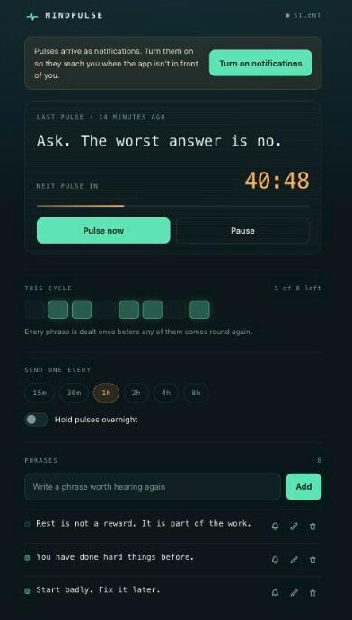

# Refrain

Write down the phrases you want to hear again. Refrain deals one back to you
as a notification on a rhythm you set — and never repeats a phrase until it has
worked through every other one.



It is a single static page. No server, no account, no build step, no
dependencies. Your phrases are stored in IndexedDB on your own device and are
never sent anywhere.

## Use it

Live at **<https://refrain.onrender.com>** — open it on your phone and add it
to your home screen to get an app icon, its own window, and notifications in
the normal tray.

## Run it locally

```sh
python3 -m http.server 8123
```

Then open <http://127.0.0.1:8123>. Any static host works just as well — GitHub
Pages, Netlify, Vercel — with no configuration; every path in the app is
relative, so serving it from a subdirectory is fine too.

Notifications need a secure context, which means `localhost` or HTTPS.
Opening `index.html` as a `file://` URL shows the app but cannot register the
service worker.

## How the phrase is chosen

Drawing uniformly at random each time is the obvious approach and it is the
wrong one. With six phrases you would see the same line twice in a row about
one pulse in six, and any given phrase could go unseen for days.

So Refrain uses a shuffle bag. Every phrase is dealt exactly once per cycle,
in a shuffled order; only when the bag is empty is it refilled and reshuffled.
Refilling also avoids opening a cycle with the phrase the previous one just
closed on, which is the single place a plain reshuffle can still repeat.

```
phrases   0 1 2 3 4 5
cycle 1   2 5 0 3 1 4     each phrase once
cycle 2   1 0 4 2 5 3     reshuffled, and never 4 first
```

Editing the list folds into the cycle already running: a deleted phrase drops
out immediately, and a phrase you add now is slotted somewhere in the part of
the cycle that has not been dealt yet, so it can turn up on the very next
pulse instead of waiting.

The **This cycle** row on screen is that bag, drawn — one tile per phrase, lit
while it is still to come, dark once it has been dealt. The tiles all relight
together when the cycle turns over.

## When pulses arrive

Delivery is done by your device, not by a server.

- Pulses arrive on your rhythm whenever Refrain is open, including in a
  background tab.
- If one came due while the app was closed, it is delivered when you come
  back — once, not once for every hour you were away.
- Installed to your home screen, Chrome may also deliver while the app is
  closed, through Periodic Background Sync.

Be clear-eyed about that last one. Chrome grants Periodic Background Sync
sparingly and throttles it to roughly twelve hours between runs, whatever
interval you chose; Safari does not implement it at all, so on an iPhone a
closed Refrain sends nothing. Delivering on your actual rhythm with the app
closed needs a push server, and this version deliberately has no server. So:
Refrain keeps your rhythm while it is open, and catches you up when you
return. Anything that arrives while it is closed is a bonus.

**Hold pulses overnight** pauses delivery between the two times you choose, and
picks up again when the window lifts.

## Advanced mode

Off by default, and while it is off nothing about the app changes.

Turned on, every phrase can be pinned to a part of the day, and only the ones
that suit the hour are sent:

```
Morning     06:00 – 12:00     momentum — something to start on
Afternoon   12:00 – 18:00     focus — something to push through with
Evening     18:00 – 24:00     reckoning — something honest
Anytime                       fits every window
```

The composer asks for the tone the window wants, so an evening phrase is
prompted for something like "Your mom is still at work right now." rather than
another line of encouragement.

Anytime is the default, which is what lets a library written before any of this
existed keep working the moment the switch is flipped: an uncategorised phrase
is an Anytime phrase, and Anytime fits everywhere.

The small hours belong to no window, and nothing is sent between midnight and
06:00. Letting Anytime phrases fill that stretch was the first design, and it
was wrong: on a small library it leaves a pool of one, and a pool of one
repeats — seven identical notifications in a row, in simulation. Holding until
06:00 costs nothing anyone wanted at 4am and keeps the promise the app is
built on.

If nothing suits the current hour, Refrain holds rather than sending
something from the wrong window, and says so on screen. The next pulse lands as
soon as a window opens with something in it, rather than an interval later.

The interval still decides how often a pulse arrives; the window only decides
what is eligible when one does.

## How much text a notification shows

Measured on a macOS notification banner rather than assumed: the title is a
single line clipped near 36 characters and cannot be expanded, while the body
wraps over three lines and holds around 110. So the phrase always goes in the
body, and the title stays a short fixed label — putting the app name in the
roomy field and the words that matter in the narrow one is the wrong way
round.

The composer caps phrases at 120 characters and shows a counter that turns
amber past 100, where a phrase starts to risk being cut off. Cyrillic is wider
than Latin, so the exact limit varies by script; under 100 is safe for both.
Nothing is truly lost either way — tapping a notification opens the app, where
the full phrase is set large with no limit at all.

## Around the app

- **Pulse now** deals one immediately, without touching the schedule.
- **Pause** stops delivery entirely until you resume.
- Muting a phrase keeps it in your list but takes it out of the rotation.
- **Export** writes your phrases to a JSON file; **Import** adds back anything
  from such a file that you do not already have, and leaves the rest alone.
  Categories travel with the phrases. Your interval and quiet hours are in the
  file too, but they are only restored into an empty app — importing into a
  library you are already using must not quietly reset how it behaves.
- **Recently sent** lists the last pulses, newest first; ones you asked for
  with **Pulse now** are marked apart from the ones the clock sent.

## Tests

```sh
npm test          # or run any one on its own: node test/bag.test.js
```

`test/schedule.test.js` covers the decisions that actually put a notification
on screen — which phrase `fire()` draws, and when `tick()` delivers, holds, or
waits — against a fake store, with no IndexedDB or DOM involved.
`test/bag.test.js` checks the guarantees the shuffle bag makes — full coverage
per cycle, no back-to-back repeats across cycle boundaries, uniform delivery
over many cycles, and correct behaviour when the phrase list is edited
mid-cycle. `test/pulse.test.js` covers the scheduling arithmetic, mostly the
overnight window, which wraps past midnight, and the time windows Advanced
Mode delivers by. `test/transfer.test.js` covers
import and export — what counts as the same phrase, and the promise that an
import never disturbs what you already have.

## Layout

```
index.html              the whole interface
styles.css
app.js                  reads state, paints it, writes back changes
lib/bag.js              the shuffle bag
lib/pulse.js            deciding when to send, what suits the hour, and sending
lib/idb.js              key/value storage on IndexedDB
lib/transfer.js         reading and writing export files
test/                   four suites, run by `npm test`
sw.js                   offline shell, background delivery, notification taps
```

`lib/` is shared: the page loads those three files with `<script>`, and the
service worker pulls in the same files with `importScripts`. A pulse delivered
while the app is closed is therefore drawn by exactly the same code as one
delivered while you are looking at it.

## Licence

MIT — see [LICENSE](LICENSE).
